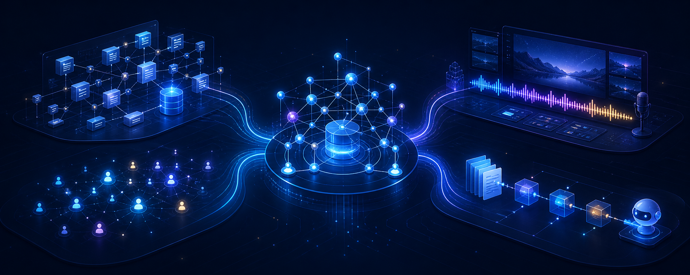

<p align="center">
  <a href="https://github.com/lulabs-org">
    
  </a>
</p>

<h1 align="center">杨仕明 · Shiming Yang</h1>

<p align="center">
  <strong>Product-minded full-stack developer</strong><br />
  I turn ambitious AI ideas into calm, dependable software.
</p>

<p align="center">
  <a href="https://github.com/lulabs-org">Building at @lulabs-org</a>
  &nbsp;·&nbsp; Shenzhen, China
</p>

<p align="center">
  
  
  
  
</p>

---

## Now · 此刻

```yaml
building:
  core: "Nove — 让组织上下文更好地服务于 AI 与 Agent"
  interfaces: [Web, API, CLI, MCP, Skills]
  side_quests: "让创作者工具更自然地融入工作流"
exploring: [Agent systems, Knowledge workflows, Programming languages, Formal methods]
north_star: "Make complexity useful, then make it disappear."
```

## 不只是写代码，而是把系统做完整

我的大部分公开作品都在 [Lu Lab](https://github.com/lulabs-org)。我喜欢从真实而混乱的业务现场出发，在产品、前端、后端、数据、Agent 接口、CLI 和原生集成之间穿行，最后把复杂性留在系统内部，把清晰留给使用者。

> **复杂系统不应该让人感到复杂。** 这是我做产品与工程时反复坚持的标准。

## Featured system · Nove

<table>
  <tr>
    <td width="68%" valign="top">
      <h3>🧠 <a href="https://github.com/lulabs-org/nove-doc">Nove</a></h3>
      <p>面向 AI / Agent 的组织数据基础设施，围绕会议、转写、参与者与业务上下文建设结构化知识和工作流。</p>
      <p>我参与建设覆盖后端、管理端、CLI、权限、数据契约与项目文档的完整产品体系。</p>
    </td>
    <td width="32%" valign="top">
      <p><strong>System surface</strong></p>
      <p>API & data model<br />Admin experience<br />CLI & Agent access<br />Permissions & contracts<br />Docs & validation</p>
    </td>
  </tr>
</table>

<p>
  <a href="https://github.com/lulabs-org/nove-api"><code>NOVE API</code></a>
  <a href="https://github.com/lulabs-org/nove-admin"><code>ADMIN</code></a>
  <a href="https://github.com/lulabs-org/nove-cli"><code>CLI</code></a>
  <a href="https://github.com/lulabs-org/nove-skills"><code>SKILLS</code></a>
  <a href="https://github.com/lulabs-org/nove-doc"><code>DOCS</code></a>
</p>

## Product constellation

<p align="center">
  
</p>

<table>
  <tr>
    <td width="50%" valign="top">
      <h3>🎬 <a href="https://github.com/lulabs-org/covercast">Covercast</a></h3>
      <p>面向竖屏直播的可视化背景编辑器。SVG 画布、模板、多场景管理，并可直接作为 OBS 浏览器源。</p>
      <p><code>Next.js</code> <code>React</code> <code>SVG</code> <code>OBS</code></p>
    </td>
    <td width="50%" valign="top">
      <h3>🔌 <a href="https://github.com/lulabs-org/Lulabs-MCP">LuLabs MCP</a></h3>
      <p>把飞书多维表格中的学员与会议总结封装成标准 MCP 工具，供 AI 助手查询与分析。</p>
      <p><code>MCP</code> <code>TypeScript</code> <code>Feishu</code> <code>Zod</code></p>
    </td>
  </tr>
  <tr>
    <td width="50%" valign="top">
      <h3>📄 <a href="https://github.com/lulabs-org/docuflow">DocuFlow</a></h3>
      <p>基于动态模板和字段校验生成 DOCX / PDF，把重复的专业文档工作变成可靠流程。</p>
      <p><code>Next.js</code> <code>DOCX</code> <code>PDF</code> <code>Automation</code></p>
    </td>
    <td width="50%" valign="top">
      <h3>🎙️ <a href="https://github.com/shimingy-zx/sound-sentinel-obs">SoundSentinel</a></h3>
      <p>原生 OBS 音频过滤器：有声音时开始录制，持续静音后停止。无需 Python、WebSocket 或后台进程。</p>
      <p><code>C++</code> <code>CMake</code> <code>OBS Native</code> <code>Audio</code></p>
    </td>
    <td width="50%" valign="top">
      <h3>💬 <a href="https://github.com/lulabs-org/wx-sidebar-helper">微信知识库助手</a></h3>
      <p>将实验室知识库带进沟通现场，让 AI 回答更贴近真实组织语境。</p>
      <p><code>React</code> <code>Knowledge Base</code> <code>Assistant</code></p>
    </td>
    <td width="50%" valign="top">
      <h3>🌐 <a href="https://github.com/lulabs-org/lulab-website">Lu Lab Website</a></h3>
      <p>承载实验室内容、项目与社区体验的 Web 平台，也是产品设计和技术实验的长期入口。</p>
      <p><code>Next.js</code> <code>Three.js</code> <code>Auth</code> <code>Content</code></p>
    </td>
  </tr>
</table>

<details>
  <summary><strong>More things I've built</strong></summary>
  <br />
  <a href="https://github.com/lulabs-org/live-ai-plugin">直播 AI 助手</a> ·
  <a href="https://github.com/lulabs-org/meeting_record">会议记录工具</a> ·
  <a href="https://github.com/shimingy-zx/sound-sentinel">SoundSentinel Python</a> ·
  <a href="https://github.com/lulabs-org/lulab-website">Lu Lab Website</a>
</details>

## My engineering compass

<table>
  <tr>
    <td align="center" width="25%"><strong>01</strong><br /><sub>Start from real use</sub></td>
    <td align="center" width="25%"><strong>02</strong><br /><sub>Design the boundary</sub></td>
    <td align="center" width="25%"><strong>03</strong><br /><sub>Build end to end</sub></td>
    <td align="center" width="25%"><strong>04</strong><br /><sub>Verify with evidence</sub></td>
  </tr>
</table>

- 从使用场景而不是技术清单开始
- 重视 API 契约、数据边界、权限模型与跨端一致性
- 用可复现测试、端到端证据和真实运行状态验证结果
- 把文档、部署方式和开发者体验视为产品本身的一部分

## Toolbox

<p>
  <strong>AI & Agents</strong> — OpenAI · MCP · Agent workflows · Knowledge systems<br />
  <strong>Application</strong> — TypeScript · NestJS · Next.js · React · Python<br />
  <strong>Data & Infrastructure</strong> — PostgreSQL · Prisma · Redis · BullMQ · REST · GraphQL<br />
  <strong>Native & Automation</strong> — C++ · CMake · OBS · Go · Browser extensions
</p>

---

<p align="center">
  <strong>Currently exploring</strong><br />
  AI product infrastructure · Agent systems · Knowledge workflows · Developer tooling · Programming languages & formal methods
</p>

<p align="center">
  <sub>Open to thoughtful conversations about ambitious ideas and dependable software.</sub>
</p>
